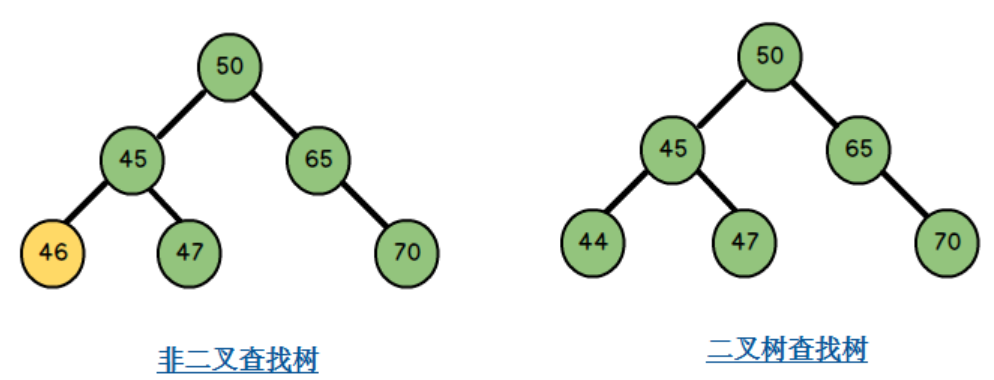

# 二叉查找树

## 简介

二叉查找树 (Binary Search Tree, BST)，又称二叉排序树 (Binary Sort Tree, BST)。它要么是是一棵空树，要么具有以下性质：

- 若它的左子树不为空，则左子树上所有节点的值均小于它根节点的值；
- 如它的的右子树不为空，则右子树上所有节点的值均大于它根节点的值；
- 它的左右子树也分别是二叉查找树。

## 插入

## 查找

## 查找最小值节点

即寻找以节点 X 为根节点的二叉排序树（或子树）的最左边的孩子节点。

## 查找最大值节点

即寻找以节点 X 为根节点的二叉排序树（或子树）的最右边的孩子节点。

## 查找后继节点

即查找以节点 X 的右孩子节点为根节点的二叉查找树子树的最小值节点。

## 查找前驱节点

## 前序遍历

## 中序遍历

## 后续遍历

## 二叉树的删除

#### 1. 删除节点为叶子节点

删除的节点为叶子节点，即既没有左子树也没有右子树的节点。此种情况可以细分为两类：

- 该节点为二叉查找树的根节点，即二叉查找树中只有一个节点。只需要将根节点指针置为空。
- 该节点有父节点，直接将父节点指向该节点的指针置为空即可。

#### 2. 删除节点只有左子树

该情况也可以分为两类：

- 该节点是根节点。只需要将根节点的指针指向该节点的左孩子，然后将该节点指向左孩子的指针置为空即可。
- 该节点有父节点，那么将父节点的指向该节点的指针指向该节点的左孩子，然后将该节点指向左孩子的指针置为空即可。

#### 3. 删除节点只有右子树

该情况也可以分为两类：

- 该节点为根节点。只需要将根节点的指针指向该节点的右孩子，然后将该节点指向右孩子的指针置为空即可。
- 如果该节点有父节点，那么将父节点指向该节点的指针指向该节点的右孩子，然后将该节点指向右孩子的指针置为空即可。

#### 4. 删除节点既有左子树又有右子树

此种情况需要分两步来完成：

- 第一步：查找该节点右子树中最小的值，也就是右子树中最左的节点的值，将最小值的节点的父节点记录下来，并且将该值赋值给待删除的节点。
- 第二步：将右子树中值最小值的节点删除。该节点一定满足上述三种情况中的一种，按相应的方法处理。