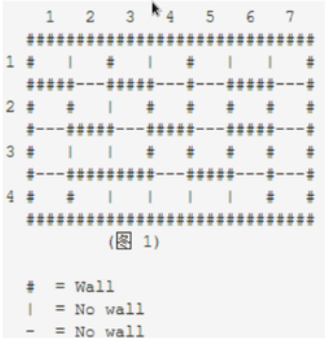

# 城堡问题

### 问题描述

如图是一个城堡的地形图。请你编写一个程序，计算城堡一共有多少个房间，最大的房间有多大。
城堡被分割成 $m \times n(m \le 50, n \le 50)$ 个方块，每个方块可以有 0 - 4 面墙。



### 输入

- 程序从标准输入读入数据。
- 第一行有两个整数，分别表示南北向，东西向的方块数。
- 在接下来的输入行里，每一个方块用一个数字描述。用一个数字表示方块周围的墙，1表示西墙，2表示北墙，4表示东墙，8表示南墙。<font color='red'>每一个方块用代表其周围墙的数字之和表示</font>。
- 输入的数据保证城堡至少有两个房间。

### 输出

- 城堡的房间数，城堡中最大的房间的所包含的方块数。

### 样例输入

```
4 7
11 6 11 6 3 10 6
7 9 6 13 5 15 5
1 10 12 7 13 7 5
13 11 10 8 10 12 13
```

### 样例输出

```
5 9
```

### 解题思路

- 对每一个方块进行深度优先搜索，从而给这个方块所能够到达的所有位置进行染色。最后统计一共用了几种颜色，以及每一种颜色的数量。

- 比如：

  ```
  1 1 2 2 3 3 3
  1 1 1 2 3 4 3
  1 1 1 5 3 5 3
  1 5 5 5 5 5 3
  ```

- 从而一共有5个房间，最大的房间（1）占据的9个方块。

```python
# -*- coding: utf-8 -*-

rows = 0  # 行数
cols = 0  # 列数
blocks = []  # 记录每个方块周围墙的情况
colors = []  # 记录每个方块所属的房间
room_nums = 0  # 房间的数量
room_area = 0  # 房间的面积
max_room_area = 0  # 最大的房间的面积


def dfs(row, col):
    if colors[row][col] != 0:
        return
    global room_area
    room_area += 1  # 房间面积加一
    colors[row][col] = room_nums  # 给这个方块染色
    if blocks[row][col] & 1 == 0:  # 表示西面无墙，向西走
        dfs(row, col - 1)
    if blocks[row][col] & 2 == 0:  # 表示北面无墙，向北走
        dfs(row-1, col)
    if blocks[row][col] & 4 == 0:  # 表示东面无墙，向东走
        dfs(row, col + 1)
    if blocks[row][col] & 8 == 0:  # 表示南面无墙，向南走
        dfs(row + 1, col)


if __name__ == '__main__':
    rows, cols = list(map(int, input().strip().split()))

    for i in range(rows):
        blocks.append(list(map(int, input().strip().split())))

    colors = [[0 for _ in range(cols)] for _ in range(rows)]

    for i in range(rows):
        for j in range(cols):
            if colors[i][j] == 0:  # 如果房间没有被染色，说明该房间可走。
                room_nums += 1
                room_area = 0
                dfs(i, j)
                max_room_area = max(max_room_area, room_area)

    print(room_nums, max_room_area)

```

