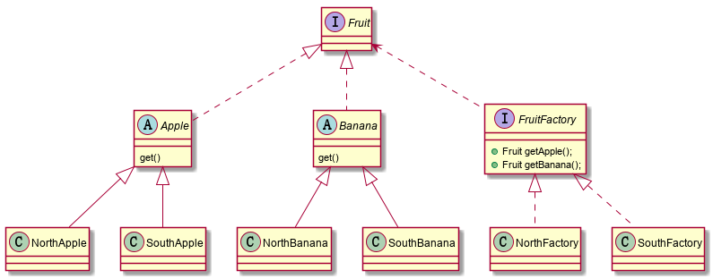

# 抽象工厂模式

抽象工厂模式是所有形态的工厂模式中最为抽象和最具一般性的一种模式。抽象工厂模式可以向客户端提供一个接口，使客户端在不必指定产品的具体的情况下，创建多个产品族中的产品对象。


## 举例说明



首先确定我们的产品族，产品族为南方水果与北方水果，而水果（产品等级）有苹果和香蕉产品等级，所以具体产品为南方苹果，北方苹果，南方香蕉，北方香蕉。

首先每一个族中都有苹果和香蕉，所以定义两个抽象类，其中包含一个抽象方法。

```java
 public abstract class Apple implements Fruit{
2     public abstract void get();
3 }
```

```java
public abstract class Banana implements Fruit{
2     public abstract void get();
3 }
```

在写苹果香蕉的具体产品，并各自继承对应的抽象类

```java
public class NorthApple extends Apple {
    @Override
    public void get() {
        System.out.println("北方苹果");
    }

}
```

```java
public class SouthApple extends Apple{
    @Override
    public void get() {
        System.out.println("南方苹果");
    }
}
```

```java
public class NorthBanana extends Banana {
    @Override
    public void get() {
        System.out.println("北方香蕉");
    }
}
```

```java
public class SouthBanana extends Banana {
    @Override
    public void get() {
        System.out.println("南方香蕉");
    }
}
```

接下来创建工厂，而每一个产品族都对应一个具体的工厂，每个产品族都包含苹果和香蕉，所以每个工厂中都包含苹果和香蕉

```java
public interface FruitFactory {
    //实例化一个苹果
    public Fruit getApple();
    //实例化一个香蕉
    public Fruit getBanana();
}
```

```java
public class NorthFactory implements FruitFactory{
    @Override
    public Fruit getApple() {
        return new NorthApple();
    }

    @Override
    public Fruit getBanana() {
        return new NorthBanana();
    }
}
```

```java
public class SouthFactory implements FruitFactory{
    @Override
    public Fruit getApple() {
        return new SouthApple();
    }

    @Override
    public Fruit getBanana() {
        return new SouthBanana();
    }
}
```

main 方法

```java
public class MainClass {
    public static void main(String[] args) {
        FruitFactory nf = new NorthFactory();
        
        Fruit nApple = nf.getApple();
        nApple.get();
        
        Fruit nBanana = nf.getBanana();
        nBanana.get();
        
        FruitFactory sf = new SouthFactory();
        
        Fruit sApple = sf.getApple();
        sApple.get();
        
        Fruit sBanana = sf.getBanana();
        sBanana.get();
    }
}
```

运行结果

```java
北方苹果
北方香蕉
南方苹果
南方香蕉
```

这时如果想新增一个产品族热带水果，只需新建一个热带产品族的工厂即可，已经建好的南方与北方工厂无需改动，也符合开放-封闭原则。

　但**缺点**也很明显，从产品等级来看，如果想新增一个产品等级，例如上面的例子只有苹果与香蕉，如果现在新增一个葡萄，就需要在抽象工厂中添加一个葡萄抽象方法，再在每一个具体工厂中实现此方法。这样就完全不符合开放-封闭原则了。

