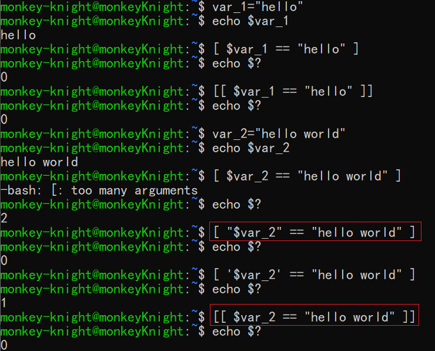
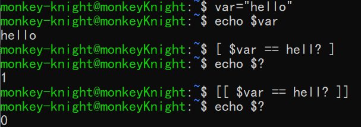
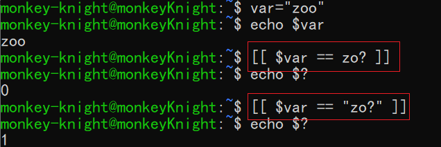
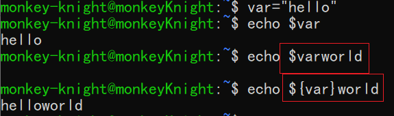
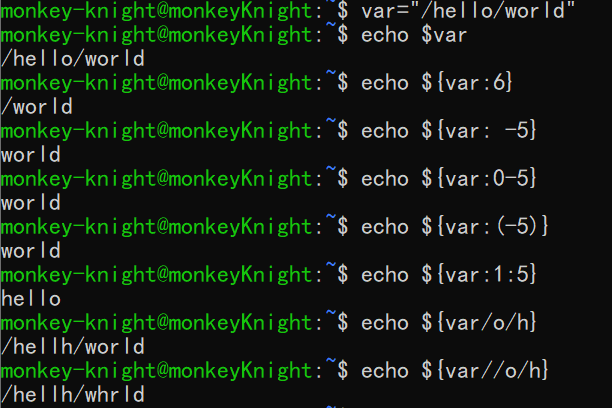

# Shell 脚本中各种括号的作用

## 一、小括号

#### 1. 单小括号 ()

- 命令组。<font color='red'>括号中的命令将会新开一个`子 shell` 顺序执行，所以括号中的变量不能够被脚本余下的部分使用</font>。**括号中多个命令之间用分号 `;` 隔开，最后一个命令后面可以没有分号，各个命令和括号之间不必有空格**。例如：

  ```shell
  (cmd1;cmd2;cmd3)
  ```

- 命令替换。shell 扫描一遍命令行，如果发现了 `$(cmd)` 结构，就会将 `$(cmd)` 中的 `cmd` 执行一次，得出其标准输出，再将此输出放到原来的命令中。此项功能等同于

  ```shell
  `cmd`
  ```

  举例加以说明：

  ```shell
  for i in `seq 0 4`
  do
  	echo $i
  done
  
  ##### 相当于 #####
  
  for i in $(seq 0 4)
  do
  	echo $i
  done
  ```

- 用于初始化数组。如：

  ```shell
  array_name=(1 2 3 4 5)
  ```


#### 2. 双小括号 (())

​		<font color='red'>`((表达式))`</font> 用来扩展 `shell` 的 <font color='red'>`算术运算`</font> ， <font color='red'>`逻辑运算`</font> ，以及 <font color='red'>`for, while, if 的条件测试运算`</font>。

注意点：

- 在双括号结构中，**所有变量可以不加 `$` 符号前缀**，当然也可以加上此符号。

- 在双括号结构中，**算术符号和数值之间可以没有空格**，也可以有空格。

  ```shell
  #! /bin/bash
  num=1
  
  while((num<10))  # 变量在使用时可以不加 $ 符号前缀；数值与运算符之间可以不加空格。
  do
  	echo $num
  	((num*=2))
  done
  ```

- 在双括号结构中，**支持多个表达式，各个表达式之间用逗号 `，` 隔开**。

- 在双括号结构中，<font color='red'>只要表示符合 `c` 语言的语法规则，都可以</font>。例如可以直接使用 `for((i=0;i<5;i++))` 。

  ```shell
  #! /bin/bash
  
  for((i=0;i<5;i++))
  do
  	echo $i
  done
  ```

  

## 二、中括号

#### 1. 单中括号 []

- bash 内部命令,<font color='red'> `[` 相当于 `test` 命令</font>。例如 `if/else` 条件判断结构中，左中括号 `[` 表示调用 `test` 命令，右中括号 `]` 表示关闭条件判断。这个命令把它的参数作为比较表达式或者作为文件测试，并且根据比较的结果来返回一个退出状态码。<font color='red'>注意，中括号与参数之间要用空格隔开</font>。

- `test` 和 `[]` 中的比较运算符只有 `==` 和 `!=`。无论是字符串还是整数都是不支持大于号或者小于号的。

- `test` 和 `[]` 中逻辑与使用 `-a` ，逻辑或采用 `-o` 表示。如：

  ```shell
  [ expression1 -a expression2 ] # 表示expression1 与 expression2
  [ expression1 -o expression2 ] # 表示expression1 或 expression2
  ```

- `[]` 还可以用于表示字符范围，主要用于正则表达式匹配。但是用于 `test` 的中括号中不能使用正则。

- `[]` 还可以数组的索引指向数组的元素。如：

  ```shell
  array_name=(1 2 3 4 5)
  echo ${array_name[0]}
  echo ${array_name[1]}
  echo ${array_name[2]}
  echo ${array_name[3]}
  echo ${array_name[4]}
  ```


#### 2. 单中括号 [] 和 双中括号 [[]] 的区别

- 第一点：

  

  从上面例子可以非常明显的看出：当变量含有空白字符时，`[]` 会对变量进行单词分离，为了避免这种情况，可以使用**双引号**将变量括起来，或者使用 `[[]]`。

- 第二点：

  

  从这个例子我们可以非常明显的看出：`[]` 不支持字符串的模式匹配，而 `[[]]` 是支持模式匹配的。

- 第三点：

  在 `[[]]` 中，如果一个字符串不加双引号，那么其就是用于匹配的模式，如果其含有 shell 元字符，则会进行扩展。如果加了双引号，那么其就是一个普通字符串，即使加上了特殊字符，还是会将其当作普通内容进行处理。例如：

  
  
- 第四点：

  `&&`，`||` ，`<` 和 `>` 可以直接在 `[[]]` 中使用，而不能够在 `[]` 使用 。例如：

  ```shell
  # 双中括号可以写成下列形式
  if [[ $a != 1 && $a != 2 ]]
  
  # 单中括号只能写成如下形式
  if [ $a != 1 ] && [ $a != 2 ] 
  # 或者
  if [ $a -ne 1 -a $a -ne 2]
  ```

  

## 三、大括号

- 常规用法

  - 大括号扩展。例如：

    ```shell
    touch {file1,file2}.txt  # 此命令会同时创建 file1.txt 和 file2.txt 两个文件。
    
    touch {file{1..3},file4}.txt # 此命令会同时创建 file1.txt, file2.txt, file3.txt, file4.txt
    
    touch {file[1-3],file4}.txt # 此命令会同时创建 file1.txt, file2.txt, file3.txt, file4.txt
    ```

    <font color='red'>在大括号中，不允许有空白，除非这个空白被引用或转义</font>。

  - 表示代码块。`{ cmd1;cmd2;cm3;}` 这个结构相当于构建了一个匿名函数。

    - 与 `(cmd1;cmd2;cmd3)` 不同，`{ cmd1;cmd2;cm3;}` 并不会启动一个 `子shell` 来运行，即余下的脚本部分可以使用 大括号内的变量。
    - 多个命令之间要用分号隔开，而且<font color='red'>最后一个命令后面也必须有分号</font>，<font color='red'>`{` 和第一个命令之间必须要有一个空格</font>。

- 用于表示变量的值。看如下的例子：

  

  可以发现，当变量名和后面的内容都是变量名所允许的内容时，直接使用 `$var` 是不行的，得加上 `{}`。

- 用于替换。

   <font color='red'>	注意</font>：以下的 `string` 既可以是一个常量，也可以是一个变量，还可以是一个命令。

  - `${var:-string}` 表示当变量 `var` 为空时，会把 `string` 作为值，但是并不会修改 `var` 的值。
  - `${var:+string}` 表示当变量 `var` 不为空时，会把 `string` 作为值，但是也不会修改 `var` 的值。
  - `${var:=string}` 表示当变量 `var` 为空时，会把 `string` 作为值，且会将 `string` 赋值给 `var`。
  - `${var:?string}` 表示当变量 `var` 为空时，会把 `string` 输出到标准错误中，并且从脚本退出。我们可以通过此特性来检测脚本中的变量是否没有给值。

- 用于模式匹配。

  - `${var%pattern}` shell 在变量 `var` 中查找，如其是以给定的 `pattern` 模式结尾，则把 `var` 的内容去掉**右边最短**的匹配，但是不修改 `var` 的值。
  - `${var%%pattern}` shell 在变量 `var` 中查找，如其是以给定的 `pattern` 模式结尾，则把 `var` 的内容去掉**右边最长**的匹配，但是不修改 `var` 的值。
  - `${var#pattern}`  shell 在变量 `var` 中查找，如其是以给定的 `pattern` 模式结尾，则把 `var` 的内容去掉**左边最短**的匹配，但是不修改 `var` 的值。
  - `${var##pattern}`  shell 在变量 `var` 中查找，如其是以给定的 `pattern` 模式结尾，则把 `var` 的内容去掉**左边最长**的匹配，但是不修改 `var` 的值。

  <font color='red'>记忆方法</font>：在键盘上 `%` 位于 `$` 右边，所以表示从右边匹配；`#` 位于 `$` 左边，所以表示从左边匹配。
  
- 用于字符串提取和替换。

   - `${var:num}` 表示 `shell` 从 `var` 提取从第 `num` 字符开始到末尾的所有字符。若 `num` 为正数，从左边开始，第一个数编号为 0；若 `num` 为负数，从右边开始，最后一个数编号为 -1，<font color='red'>注意此时，必须在冒号后面加上空格，或者在冒号后面加上数字构成表达式，或者用小括号将 `num` 括起来</font>。不会修改 `var` 的值。
   - `${var:num1:num2}` 其中 `num1` 是位置，`num2` 是长度。此模式表示 `shell` 从 `var` 中的第 `num1` 个字符开始提取长度为 `num2` 的子串。**注意，不能是负数**。也不会修改 `var` 的值。
   - `${var/pattern1/pattern2}` 表示将 `var` 中**第一个** `pattern1` 匹配的内容替换成 `pattern2`。不会修改 `var` 的值。
   - `${var//pattern1/pattern2}` 表示将 `var` 中**所有** `pattern1` 匹配的内容替换成 `pattern2`。不会修改`var` 的值。

   举例：

   

