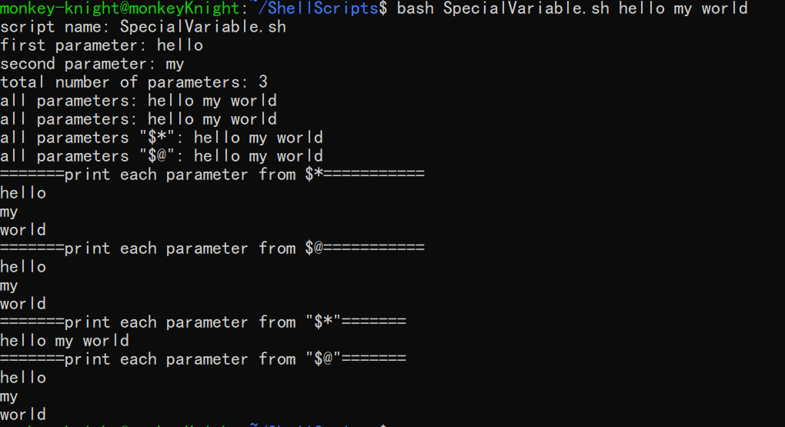

# shell 特殊变量和命令行参数

<center>特殊变量和命令行参数的表格</center>

| 特殊变量 | 含义                                                         |
| -------- | ------------------------------------------------------------ |
| `$0`     | 当前运行的脚本的文件名                                       |
| `$n`     | 传递给脚本或函数的参数，其中`n`是数字，表示第几个参数。例如`$1`表示第一个参数 |
| `$#`     | 传递给脚本或函数的参数个数                                   |
| `$*`     | 传递给脚本或函数的所有参数                                   |
| `$@`     | 传递给脚本或函数的所有参数。被双引号(" ")包含时，与 $* 稍有不同，区别请看。。。。。。 |
| `$?`     | 上一个命令的退出状态，或者函数的返回值                       |
| $$       | 当前 shell 进程 ID                                           |


## `$*` 和 `$@` 的区别

`$* ` 和 `$@` 都表示传递给函数或脚本的所有参数，不被双引号 `" "` 括起来时，都以"`$1`" "`$2`" … "`$n`" 的形式输出所有参数。

但是当它们被双引号 `" "` 括起来时，"`$*`" 会将所有的参数作为一个整体，以"`$1` `$2` … `$n`" 的形式输出所有参数；"`$@`" 会将各个参数分开，以"`$1`" "`$2`" … "`$n`" 的形式输出所有参数。


## 特殊变量举例说明

脚本 `SpecialVariable.sh` 的内容为：

```shell
#！ /bin/bash

echo "script name: $0"
echo "first parameter: $1"
echo "second parameter: $2"
echo "total number of parameters: $#"
echo "all parameters: $*"
echo "all parameters: $@"
echo "all parameters \"\$*\": "$*""
echo "all parameters \"\$@\": "$@""

echo "=======print each parameter from \$*==========="
for var in $*
do
        echo "$var"
done

echo "=======print each parameter from \$@==========="
for var in $@
do
        echo $var
done

echo "=======print each parameter from \"\$*\"======="
for var in "$*"
do
        echo $var
done

echo "=======print each parameter from \"\$@\"======="
for var in "$@"
do
        echo $var
done
```

执行脚本的命令为：

```shell
bash SpecialVariable.sh hello my world
```

运行结果为：



