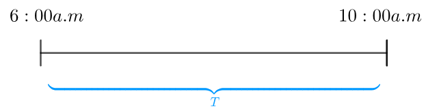
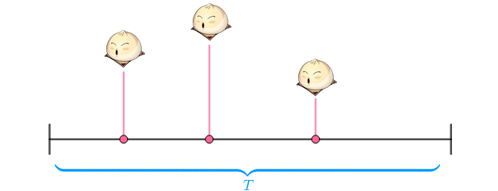
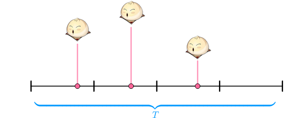
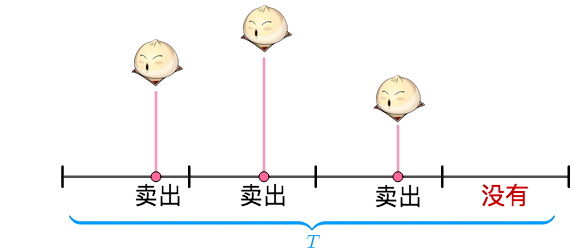
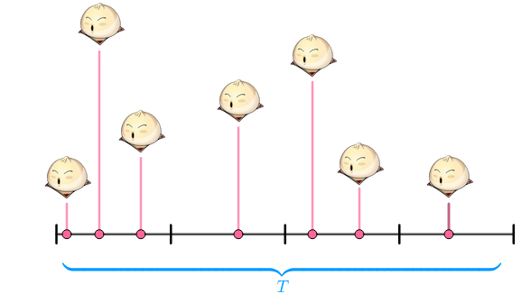
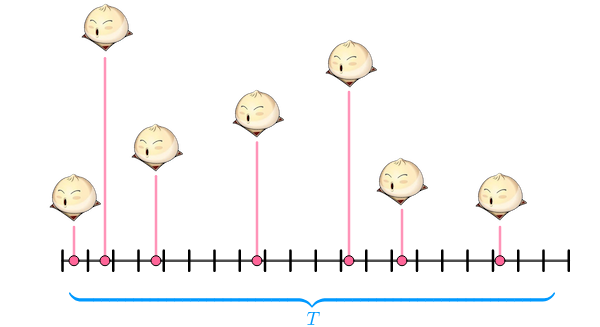
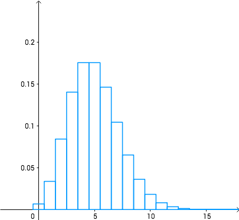
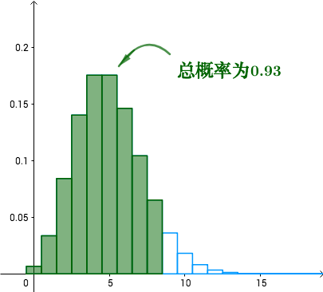
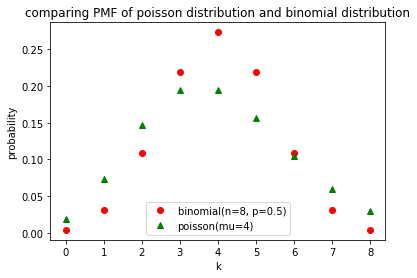
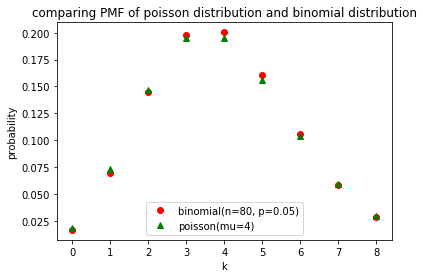

<!--more-->

原文地址：<https://blog.csdn.net/ccnt_2012/article/details/81114920>

{:.rounded}

## 馒头店

有一家馒头店，每天早上六点到十点营业，生意挺好，就是发愁一个事情，应该准备多少个馒头才能既不浪费又能充分供应？

老板统计了在一周中每天卖出的馒头数（为了方便计算和讲解，缩小了数据）：

{:.rounded}

均值为：

$$
\overline{X} = \frac{3 + 7 + 4 + 6 + 5}{5} = 5
$$

按道理讲均值是不错的选择（参见[如何理解最小二乘法](https://www.matongxue.com/madocs/818.html)？），但是如果每天准备 $5$ 个馒头的话，从统计表来看，至少有两天不够卖，$40\%$ 的时间不够卖：

馒头店又不是小米，搞什么饥饿营销啊？老板当然也知道这一点，就拿起纸笔来开始思考。

## 老板的思考

老板尝试把营业时间抽象为一根线段，把这段时间用 $T$ 来表示：

然后把周一的三个馒头按照销售时间放在线段上：

把 $T$ 分成四个时间段：

此时，在每一个时间段上，要不卖出一个馒头，要不没有卖出：

在每个时间段，就有点像抛硬币，要不是正面（卖出），要不是反面（没有卖出）。

在 $T$ 时间段内卖出 $3$ 个馒头的概率，就和抛了 $4$ 次硬币（$4$ 个时间段），其中 $3$ 次正面（卖出 $3$ 个）的概率一样了。这样概率就可以通过二项分布来计算：

$$
C_4^3 p^3(1-p)^1
$$

但是，如果把周二的 $7$ 个馒头放在线段上，分成四段就不够了：

从图中看，每个时间段，有卖出 $3$ 个的，有卖出 $2$ 个的，有卖出 $1$ 个的，就不再是单纯的“卖出、没卖出”了。不能套用二项分布了。

解决这个问题也很简单，把 $T$ 分为20个时间段，那么每个时间段就又变为了抛硬币：

这样，$T$ 时间段内卖出 $7$ 个馒头的概率就是（相当于抛了 $20$ 次硬币，出现 $7$ 次正面）：

$$
C_{20}^7p^7(1-p)^{13}
$$

为了保证在一个时间段内只会发生“卖出、没卖出”，干脆把时间切成 $n$ 份：

$$
C_n^7p^7(1-p)^{n-7}
$$

越细越好，用极限来表示：

$$
\underset{n \rightarrow \infty}{lim}C_n^7p^7(1-p)^{n-7}
$$

更加抽象一点，在 $T$ 时间段卖出 $K$ 个馒头的概率：

$$
\underset{n \rightarrow \infty}{lim} C_n^kp^k(1-p)^{n-k}
$$

## 如何求 $p$

“那么”，老板用笔敲了敲桌子，“只剩下一个问题，概率 $p$ 怎么求？”。在上面的假设下，问题已经被转为了二项分布。二项分布的期望为：

$$
E(X) = np = \mu
$$

那么：

$$
p = \frac{\mu}{n}
$$

所以：

$$
\underset{n \rightarrow \infty}{lim} C_n^kp^k(1-p)^{n-k}=\underset{n \rightarrow \infty}{lim}C_n^k(\frac{\mu}{n})^k(1-\frac{\mu}{n})^{n-k}
$$

我们来计算一下这个极限：

$$
\begin{align*}
\underset{n \rightarrow \infty}{lim}C_n^k(\frac{\mu}{n})^k(1-\frac{\mu}{n})^{n-k} &= \underset{n \rightarrow \infty}{lim}\frac{n(n-1)(n-2) \cdots (n-k+1)}{k!} \frac{\mu^k}{n^k}(1-\frac{\mu}{n})^{n-k} \\ 
 &= \underset{n \rightarrow \infty}{lim}\frac{\mu^k}{k!} \frac{n}{n}\cdot\frac{n-1}{n}\cdot\frac{n-2}{n}\cdots\frac{n-k+1}{n}(1-\frac{\mu}{n})^{-k}(1-\frac{\mu}{n})^{n} 
\end{align*}
$$

其中：

$$
\underset{n \rightarrow \infty}{lim} \frac{n}{n}\cdot\frac{n-1}{n}\cdot\frac{n-2}{n}\cdots\frac{n-k+1}{n}(1-\frac{\mu}{n})^{-k} = 1
$$

$$
\underset{n \rightarrow \infty}{lim}(1-\frac{\mu}{n})^{n} = e^{-\mu}
$$

所以：

$$
\underset{n \rightarrow \infty}{lim}C_n^k(\frac{\mu}{n})^k(1-\frac{\mu}{n})^{n-k} = \frac{\mu^k}{k!}e^{-\mu}
$$

上面就是泊松分布的概率密度函数，也就是说，在 $T$ 时间内卖出 $k$ 个馒头的概率为：

$$
P(X=k)=\frac{\mu^k}{k!}e^{-\mu}
$$

一般来说，我们会换一个符号，让 $\mu = \lambda$，所以：

$$
P(X=k)=\frac{\lambda^k}{k!}e^{-\lambda}
$$

这就是教科书中的泊松分布的概率密度函数。

## 馒头店问题的解决

老板依然蹙眉，不知道 $\mu$ 啊。

没关系，刚才不是计算了样本均值：

$$
\overline{X} =  5
$$

用它来近似：

$$
\overline{X} \approx \mu
$$

于是：

$$
P(X=k)=\frac{5^k}{k!}e^{-5}
$$

画出概率密度函数的曲线就是：

可以看到，如果每天准备 $8$ 个馒头的话，那么足够卖的概率就是把前 $8$ 个的概率加起来：

这样 $93 \%$ 的情况够用，偶尔卖缺货也有助于品牌形象。

老板算出一脑门的汗，“那就这么定了！”

## 二项分布与泊松分布

鉴于二项分布与泊松分布的关系，可以很自然的得到一个推论，当二项分布的 $p$ 很小的时候，两者比较接近：

