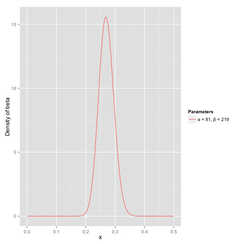
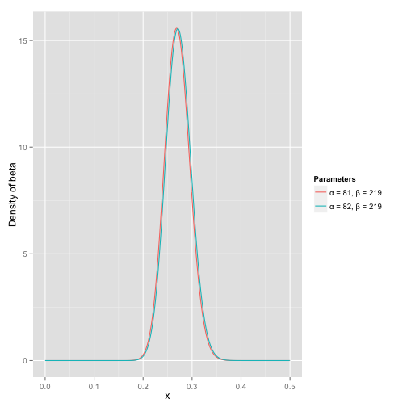
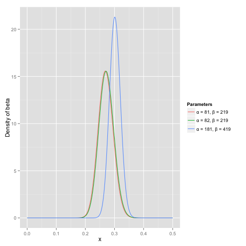

<!--more-->

英文原文地址：<http://varianceexplained.org/statistics/beta_distribution_and_baseball/>

像[正太分布（Normal Distribution）](http://varianceexplained.org/statistics/beta_distribution_and_baseball/)、[二项分布（Binomial Distribution）](http://varianceexplained.org/statistics/beta_distribution_and_baseball/)、[均匀分布（Uniform Distribution）](http://varianceexplained.org/statistics/beta_distribution_and_baseball/)这样一些分布在统计学教学中会结合它们在现实中的意义和应用加以解释，这也意味着统计学的初学者对它们的有非常深刻的理解。但是我发现 [Beta 分布](http://en.wikipedia.org/wiki/Beta_distribution)几乎没有直观上的解释，取而代之的是大量的术语，比如“共轭先验（conjugate prior）”和”顺序统计（order statistic）“。

简而言之，Beta 分布可以被理解为概率的概率分布（probability distribution of probabilities）——也就是说，当我们不知道概率是多少时，它可以表示概率的所有可能的值。下面的我最喜欢的关于 Beta 分布的解释：

任何关注棒球的人应该都很熟悉平均击球率——简单的做法就是使用他击球的次数除以他击中球的次数（因此是一个 $0$ 到 $1$ 之间的百分比）。普遍认为平均击球率是 $0.266$，如果能达到 $0.3$，那他会被认为相当的优秀。

想象我们有一个棒球运动员，而且我们想要预测他的赛季平均击球率。你可能会用他到目前为止的平均击球率——但是在赛季刚开始时这是一个非常不好衡量标准。如果一个球员击球一次，刚好击中，那么他平均击球率即是 $100\%$ ，如果他被判出局，那么他的平均击球率就是 $0\%$。如果球员尝试 $5$ 到 $6$ 次，结果也不见得会变得多么好，他可能非常幸运，全中，那么平均击球率就是 $100\%$，也有可能非常不幸，一个也没中，那么平均击球率就是 $0\%$。无论哪一种衡量标准都不能够很好的预测。

为什么你在前几次击球中的平均击球率不能很好地预测你最终的平均击球率？当一个球员的第一次击球出局，为什么没有人预测他整个赛季都不会得分？因为我们有先验知识，我们知道在历史上，大多数的赛季平均击球率在 $0.215$ 到 $0.360$ 之间，两边都有一些非常罕见的例外。我们知道，如果一个球员在开始时连续几次被判出局，这可能意味着他会比平均水平差一点，但我们知道他可能不会偏离这个范围。

对于平均击球率问题，可以用二项式分布（一系列成功和失败）来表示，但是表示这些先前期望的最佳方式（我们在统计中称之为先验）是 Beta 分布——在我们看到球员第一次挥杆之前，我们粗略估计其平均击球率。Beta 分布的定义域是 $[0,1]$，就像概率一样。但是 Beta 分布的适当性远不止于此。

我们假定球员的赛季平均击球率最可能是 $0.27$，但是我们认为在 $0.21$ 到 $0.35$ 之间都是合理的。这可以使用参数为 $\alpha=81$ 和 $\beta=219$ 的 Beta 分布来表示：

我提出这些参数有两个原因：

- 均值是 $\frac{\alpha}{\alpha + \beta} = \frac{81}{81 + 219} = 0.27$。
- 正如图中所示，这个分布几乎完全在 $0.2$ 到 $0.35$ 之间。

x 轴就表示平均击球率。

想象一下，玩家击球一次，那么他本赛季目前的成绩就是”1击；1中“，但是我们必须要更新我们的概率——我们希望能够将整个曲线移动一点来反映我们的新信息。虽然[数学证明](http://en.wikipedia.org/wiki/Conjugate_prior#Example)很复杂，但是结果很简单。新的 Beta 分布将是：

$$
Beta(\alpha + hits, \beta + misses)
$$

其中 $\alpha$ 和 $\beta$ 也就是我们刚开始的参数 $81$ 和 $219$。因此，在此情况下，$\alpha$ 会加 $1$ （击中一次），然而 $\beta$ 不会增加。这意味着我们新的分布将是 $Beta(81 + 1, 219)$。将其与原分布做一下比较：

我们从图中发现，几乎没有什么变化，那是因为一次击球并并不能代表什么。

可是，当球员击球的次数变多，曲线也会不断的变化，而且图像也会越变越窄。假设球员击球 $300$ 次，其中击中 $100$ 次，$200$ 次没有击中，那么新的 Beta 分布就是 $Beta(81 + 100, 219 + 200)$，图像如下：

我们会发现，图像向右移动而且变的更窄。我们就能够更好的了解球员的平均击球率。

这个公式最有趣的一点就是，最终的 Beta 分布的期望值实际上就是你的新的估计值。回想一下，Beta 分布的期望值是 $\frac{\alpha}{\alpha + \beta}$。因此，当击球 $300$ 次，击中 $100$ 次后，新的 Beta 分布的期望值就是 $\frac{82 + 100}{82 + 100 + 219 + 200} = 0.303$，注意到它是小于 $\frac{100}{100 + 200}=0.333$ 的，但是又比最初的假设 $\frac{81}{81 + 219} = 0.27$ 要高一些。你可能会注意到，这个公式相当于在一个球员的命中次数和非命中次数上加上一个“首发”——即“在这个赛季开始他的 $81$ 次命中和 $219$ 次非命中”。

因此，Beta分布最适合表示概率的概率分布——在这种情况下，我们事先不知道概率是什么，但我们有一些合理的猜测。