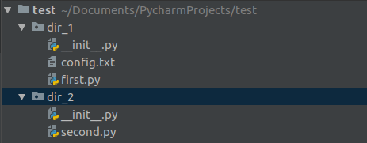
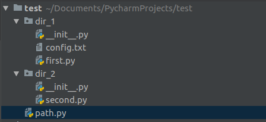

# 解决 Python 不同模块使用相对路劲访问文件，显示文件不存在的问题。

参考博客地址：

1. <https://blog.csdn.net/cxx654/article/details/79371565>
2. <https://www.jianshu.com/p/cd421014cfbb>

### 问题说明

在 `Python` 中使用相对路劲会存在以下问题，示例代码结构如下：



其中 `dir_1` 包中包含两个文件 `first.py` 和 `config.txt`，`first.py` 代码中只有一个函数`read_file()`，用于使用相对路径读取 `config.txt` 文件第一行的内容，并打印结果。代码如下：

```python
import os

print('当前路劲', os.getcwd())

def read_file():
    with open("config.txt", encoding='utf-8') as f:
        content = f.readline()
        print("文件内容 -> %s" % content)


if __name__ == '__main__':
    read_file()

```

其中 `os.getcwd()` 函数是用于获取当前工作目录。

`first.py` 运行的结果如下所示：


`dir_2` 目录下存在一个 `second.py` 文件，在这个文件中调用 `first.py` 文件中的 `read_file()` 方法读取 `config.txt` 文件，代码如下：

```python
from dir_1.first import read_file

read_file()

```

`second.py` 运行的结果如下所示：


运行 `second.py` 出现了错误，提示 `config.txt` 不存在。而通过 `os.getcwd()` 获得的当前工作目录由 `first.py` 中得到的 `XXX/test/dir_1` 变成了 `second.py` 中的 `XXX/test/dir_2`。<font color='red'>所以程序报错文件不存在的根本原因是因为当前路径变了，导致代码中的由相对路径构成的绝对路径发生了变化</font>。


### 解决方法

对于这个问题有多种的解决办法：

1. 在使用相对路劲进行文件访问的模块中加入如下代码即可：

   ```python
   current_path = os.path.dirname(os.path.abspath(__file__))  # 当前文件的绝对路劲,获取当前文件上一层目录
   ```

   其中 `os.path.abspath(__file__)` 是获取当前文件的绝对路劲，`os.path.dirname()` 是用于获取路劲中的目录。

   修改后的 `first.py` 代码如下：

   ```python
   import os
   
   print('当前路劲', os.getcwd())
   
   current_path = os.path.dirname(__file__)
   
   def read_file():
       with open(os.path.join(current_path, "config.txt"), encoding='utf-8') as f:
           content = f.readline()
           print("文件内容 -> %s" % content)
   
   
   if __name__ == '__main__':
       read_file()
   
   ```

2. 同样我们也可以在工程的根目录创建一个文件 `path.py` 用来获取路劲。添加 `path.py` 文件之后的代码结构如下：

   

   其中 `path.py` 中的代码如下：

   ```python
   import os
   
   
   def get_root_path():
       return os.path.dirname(os.path.abspath(__file__))
   
   
   def get_dir1_path():
       return os.path.join(get_root_path(), 'dir_1')
   
   
   def get_config_path():
       return os.path.join(get_root_path(), 'config.txt')
   
   ```

   这样就可以在任意一个模块中通过调用 `path.py` 中的 `get_config_path()` 函数来获取 `config.txt` 的绝对路劲。