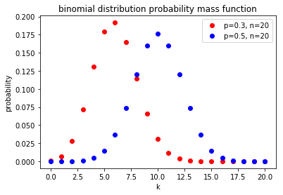
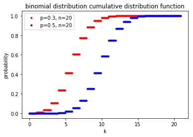

# 几种重要的分布

## 0-1 分布

**0-1 分布**，又叫做 **$1$ 重伯努利（Bernoulli）试验**。记为 $X \sim B(1, p)$

一个事件 $A$ 要么发生，要么不发生，不存在其他情况。$A$ 发生的概率为 $p$，则不发生的概率就为 $1-p$。
$$
\begin{bmatrix}
X & 1 & 0\\ 
P_x & p & 1-p
\end{bmatrix}
$$

#### 0-1 分布数学期望

$$
\begin{align*}
E(X) &= 1 \times p + 0 \times (1-p) \\ 
 &= p
\end{align*}
$$

#### 0-1 分布方差

$$
\begin{align*}
D(X) &= E(X^2) - (E(X))^2\\ 
 &= 1^2 \times p + 0^2 \times (1-p)^2 - p^2 \\
 &= p(1-p)
\end{align*}
$$

## 二项分布

**二项分布**，又叫做 **$n$ 重伯努利（Bernoulli）试验**。记为 $X \sim B(n, p)$

- 每次试验只有两个结果，事件要么发生，要么不发生。
- 每次试验事件发生的概率为 $p$，事件不发生的概率 $1-p$。
- 每次试验相互独立。

$$
P(X=k)=C_n^kp^k(1-p)^{n-k}, (k=0,1,\dots,n)
$$

#### 二项分布数学期望

#### 二项分布方差

#### Probability Mass Function

#### Cumulative Distribution Function

## 几何分布

$$
Pr(X=k)=p(1-p)^{k-1}
$$

## 超几何分布

## 泊松分布

[泊松分布的详细介绍](./poisson_distribution.md)
$$
Pr(X=k)=\frac{\lambda^k}{k!}e^{-\lambda}, (k=1,2, \dots)
$$

## 均匀分布

## 指数分布

## 正太分布

## $\beta$ 分布

